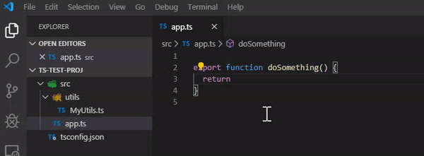

# ts-namespace-imports

Detects and adds completion for namespace like imports in Typescript.

A [namespace import](http://exploringjs.com/es6/ch_modules.html#_importing-styles) is an import like:

```
import * as Utils from "./Utils.ts"
```

_Note: I borrowed the idea of this extension from [this extension](https://github.com/Asana/typescript-namespace-imports-vscode-plugin), but it didnt work how I wanted so I rewrote much of it._

## Features

This extension scans your project looking for .TS files that start with a capital letter. It then offers then up in the auto-completion.



## Requirements

TS file must start with a capital letter for it to be considered for completion.

## Release Notes

### 0.0.3

- Now ignoring ts files found in `node_modules`

### 0.0.1

- Very first experimental release
